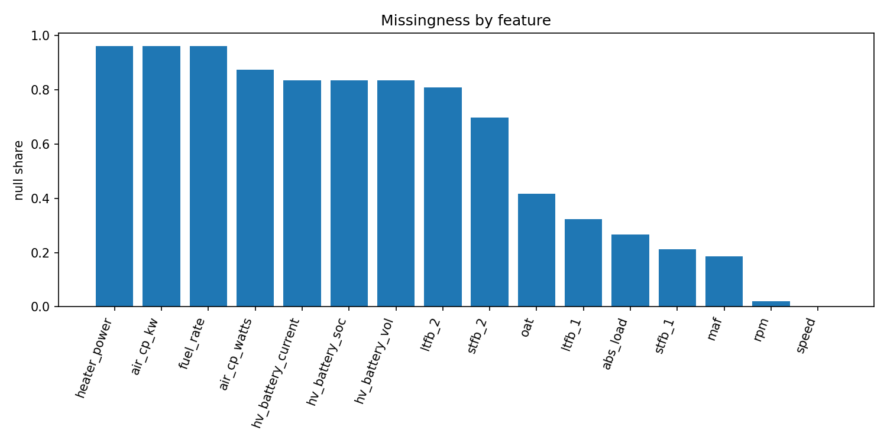
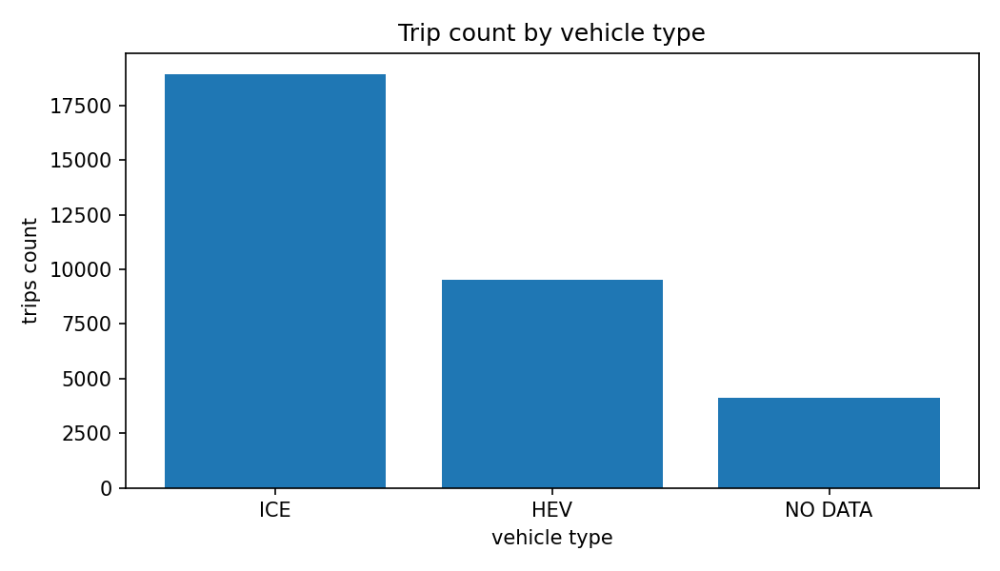
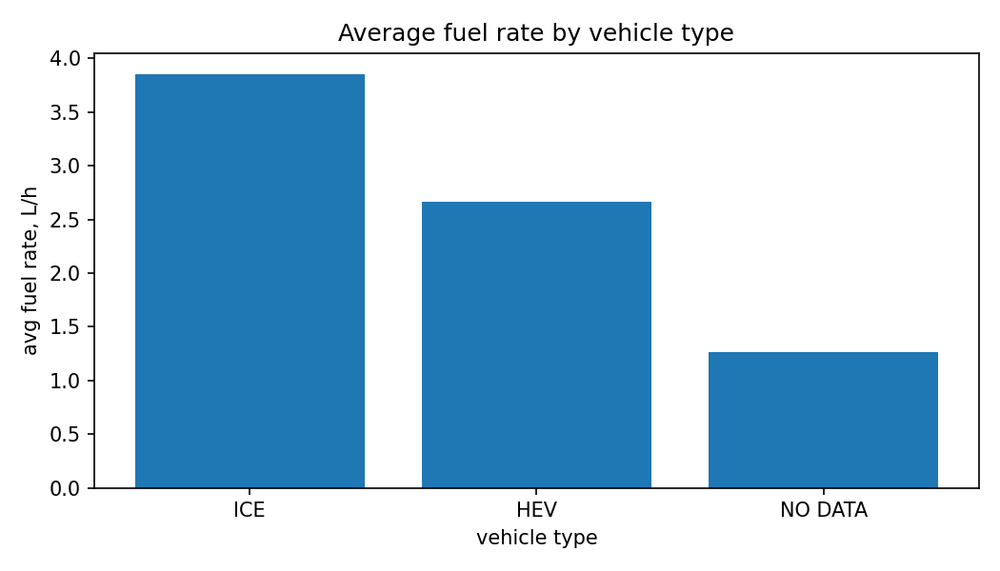
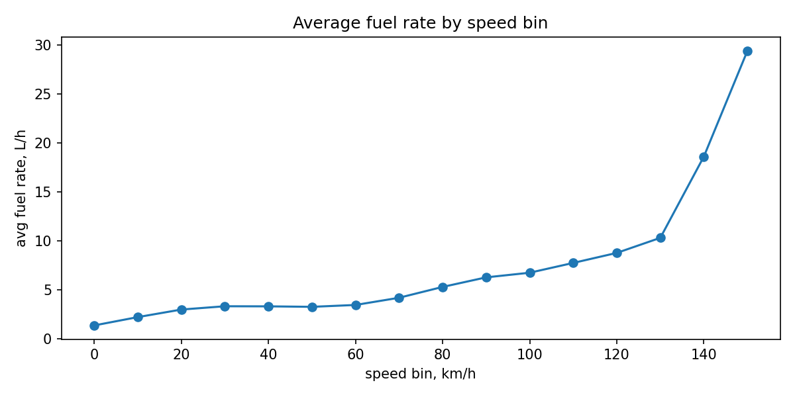
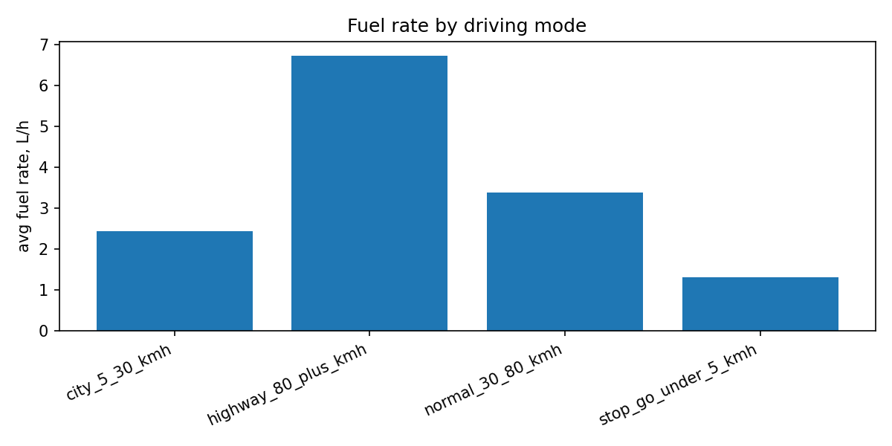
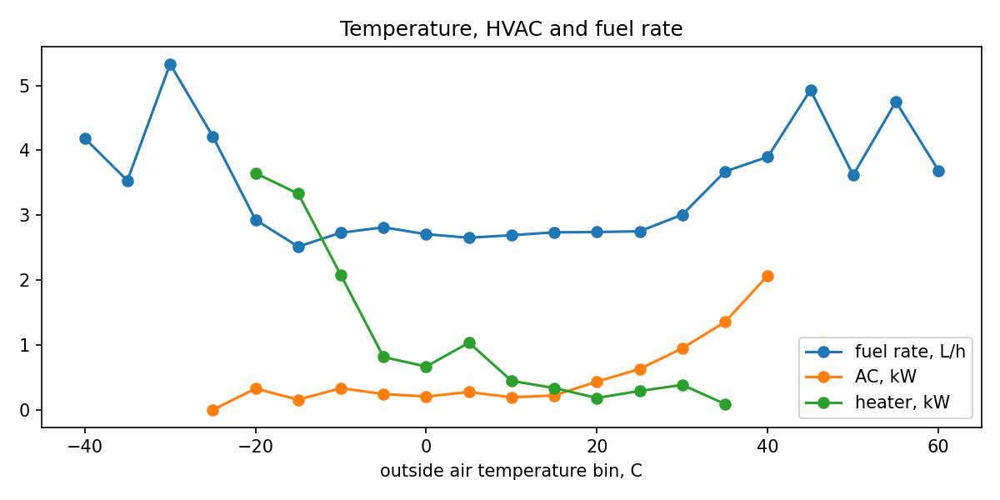
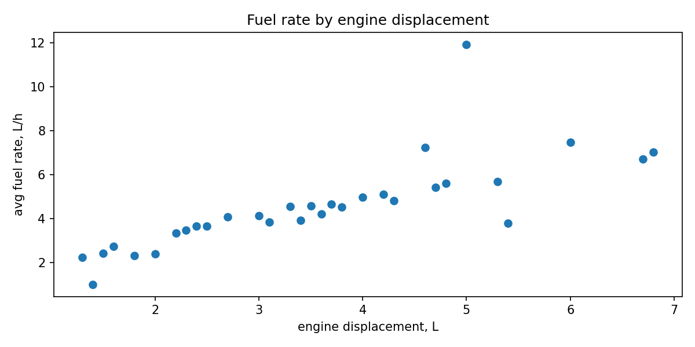
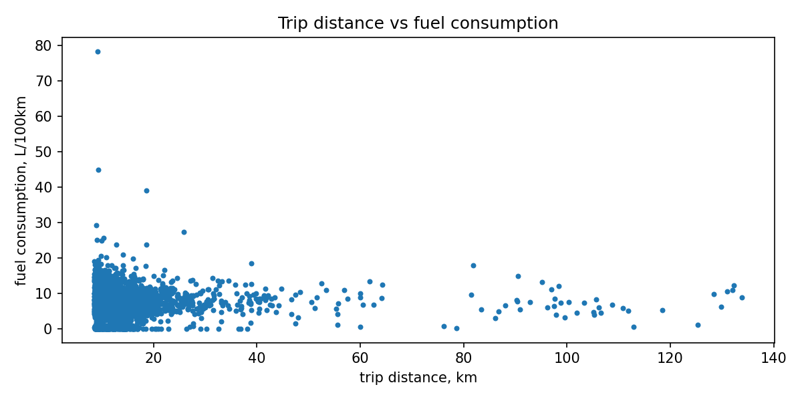

# Stage 2: Data Understanding, EDA, and Feature Engineering

## TL;DR

Stage 2 reads the HDFS warehouse with Spark, joins trip telemetry with vehicle metadata, creates EDA tables, estimates missing fuel rate from MAF, aggregates sensor-level rows into trip-level features, and exports small CSV files and figures for reporting.

## Dataset snapshot

The Stage 2 data-characteristics output reports:

| Metric | Value |
|---|---:|
| Telemetry rows | 22,436,808 |
| Vehicles | 384 |
| Unique trips | 32,552 |
| Raw trip columns | 22 |
| Vehicle columns | 9 |

## Main scripts

| Script | Responsibility |
|---|---|
| `scripts/stage2_data_profiling.sh` | Profiles raw HDFS warehouse tables. |
| `scripts/stage2_data_profiling.py` | Writes table overview, types, missingness, summaries, quantiles, categorical summaries. |
| `scripts/stage2.sh` | Runs Spark EDA and downloads small CSV exports. |
| `scripts/stage2_spark_eda.py` | Builds EDA tables and trip-level features. |
| `scripts/build_stage2_charts.py` | Generates local Stage 2 figures from exported CSVs. |

## Data quality

The main data-quality issue is sparsity in fuel and energy-related fields.

Raw `fuel_rate` is missing in most telemetry rows, so Stage 2 uses a fallback fuel-rate approximation from MAF when direct `fuel_rate` is unavailable. Hybrid battery fields are also sparse because they apply only to specific powertrain configurations.

## Fuel-rate approximation

When raw `fuel_rate` is unavailable, fuel rate is estimated as:

```text
fuel_rate_est_lhr = maf / 14.7 / 745 * 3600
```

where:

- `maf` is mass air flow in grams per second;
- `14.7` is the stoichiometric air-fuel ratio for gasoline;
- `745 g/L` is the gasoline density used in this approximation;
- `3600` converts seconds to hours.

## Insight 1: Missingness by feature

The missingness chart shows that fuel and energy-related fields are sparse. This explains why the pipeline needs fuel-rate approximation and why feature availability matters during modeling.



Source file:

```text
output/eda/eda_missingness.csv
```

## Insight 2: Vehicle type distribution

The dataset contains ICE, HEV, and records with missing vehicle type. Vehicle type is important because fuel and energy behavior differs across powertrain technologies.



Source file:

```text
output/eda/insight_01_vehicle_type_distribution.csv
```

## Insight 3: Fuel rate by vehicle type

Fuel-rate behavior differs by vehicle type, so vehicle metadata should be used as predictive context.



Source file:

```text
output/eda/insight_02_fuel_by_vehicle_type.csv
```

## Insight 4: Fuel rate by speed bin

Fuel rate changes across speed regimes. Distance alone is not enough to explain consumption; speed profile should also be included.



Source file:

```text
output/eda/insight_03_fuel_by_speed_bin.csv
```

## Insight 5: Driving mode vs fuel

Stop-go, city, normal, and highway regimes have different fuel-rate profiles. This motivates trip-level features such as `stop_go_ratio`, `idle_time_min`, `speed_mean`, and `speed_p95`.



Important interpretation: L/h is fuel intensity per time, not efficiency per distance. A low-speed mode may have lower L/h but still poor L/100km efficiency.

Source file:

```text
output/eda/insight_04_stop_go_vs_fuel.csv
```

## Insight 6: Temperature, HVAC, and fuel

Outside air temperature is related to AC and heater usage. Environmental context can influence fuel and energy consumption.



Source file:

```text
output/eda/insight_05_temperature_hvac_fuel.csv
```

## Insight 7: Engine displacement and fuel rate

Engine displacement is associated with fuel-rate differences. It should be interpreted together with vehicle type and driving conditions.



Source file:

```text
output/eda/insight_06_engine_displacement_fuel.csv
```

## Insight 8: Trip distance vs fuel consumption

The trip-level sample shows how fuel consumption varies across trip distance. This helps validate trip-level aggregation and detect outliers.



Source file:

```text
output/eda/trip_features_sample.csv
```

## Trip-level feature engineering

The raw `trips` table is sensor-level. Stage 2 aggregates it into a trip-level table where each row corresponds to one `(vehid, tripid)` pair.

The resulting features include:

| Feature group | Examples |
|---|---|
| Trip identity and duration | `vehid`, `tripid`, `daynum`, `duration_min`, `observed_seconds` |
| Distance and fuel | `distance_km`, `fuel_used_l`, `fuel_l_per_100km` |
| Speed profile | `speed_mean`, `speed_median`, `speed_p95` |
| Driving regime | `stop_go_ratio`, `idle_time_min` |
| Engine behavior | `maf_mean`, `maf_p95`, `rpm_mean`, `rpm_p95`, `abs_load_mean` |
| Environment | `oat_mean` |
| Hybrid battery context | `hv_current_mean`, `hv_soc_mean`, `hv_voltage_mean` |
| Vehicle metadata | `vehtype`, `vehclass`, `transmission`, `drive_wheels`, `gen_weight`, `eng_type`, `eng_dis`, `eng_conf` |

Trips shorter than `0.5 km` are filtered out to reduce noise in L/100km calculations.

## Outputs

| Output | Location |
|---|---|
| Profiling HDFS outputs | `/user/team15/project/profiling` |
| Profiling local CSV outputs | `output/profiling/*.csv` |
| Analytical Parquet outputs | `/user/team15/project/analytics` |
| Small CSV exports | `/user/team15/project/analytics_csv`, `output/eda` |
| Generated figures | `output/figures` |
| Committed report figures | `docs/figures/stage2` |

## How to run

```bash
bash scripts/stage2_data_profiling.sh
bash scripts/stage2.sh
```

## How to validate

```bash
hdfs dfs -ls /user/team15/project/analytics
hdfs dfs -ls /user/team15/project/analytics/trip_features
ls output/profiling
ls output/eda
```
